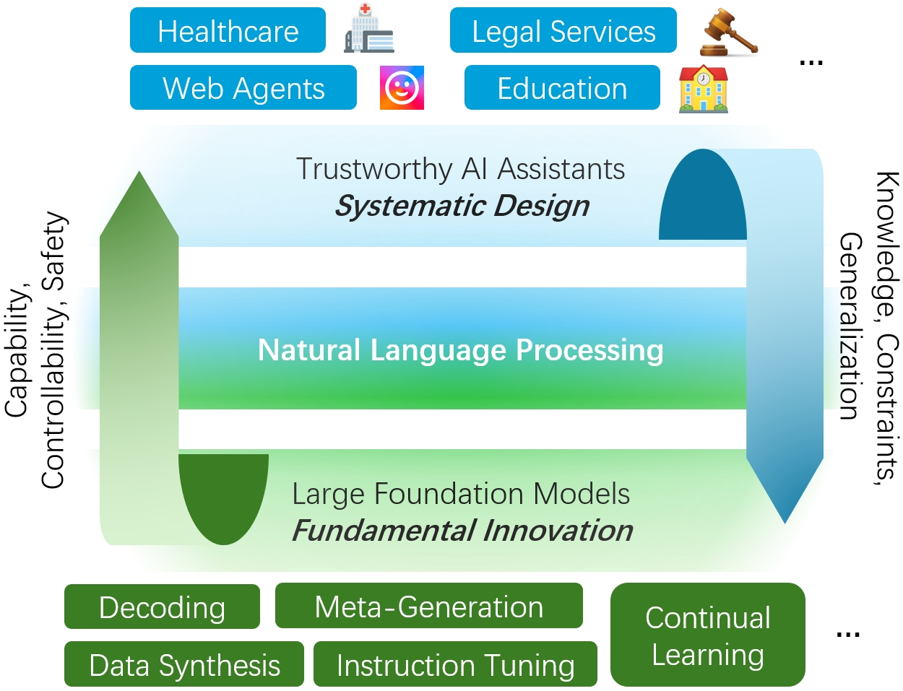

## About Me

I am an Assistant Professor at the Department of Computer Science at [University of California, Merced](https://www.ucmerced.edu/). I am leading [UC Merced NLP Lab](https://wangywust.github.io/ucmnlp).

## Recruiting

**Recruiting Ph.D. students and (remote) research interns.** I’m actively looking for students at all levels interested in large language models' research. If you are interested, please feel free to email me. 

## Main Experience

| Institution | Period |
|:--|--:|
| University of California, Merced | Jan. 2025 - Present |
| UCLA NLP Lab | Sep. 2023 - Dec. 2024 |
**Advisor:** Kai-Wei Chang, Nanyun Peng |
| Amazon | Sep. 2022 - Sep. 2023 |
| National University of Singapore | Jul. 2019 - Mar. 2023 |
**Advisor:** Bryan Hooi |
| Hong Kong University of Science and Technology | Aug. 2017 - Jun. 2019 |
| Southeast University | Aug. 2013 - Jun. 2017 |
**Main Advisor:** Shi Jin, Liang An, Qinzhen Xu, Yuanfang Li, Qiao Wang, etc. |

## Research Focus

**My research focuses on large foundation models based trustworthy natural language processing and its applications as AI assistants. Our research considers not only textual but also vision data, with the target of understanding ubiquitos multi-modal data in real-world applications.**   



## Teaching
- Instructor, [Large Language Models](https://wangywust.github.io/courses) at University of California, Merced, 2025
- Teaching Assistant, [Knowledge Discovery and Data Mining](https://nusmods.com/modules/CS5228/knowledge-discovery-and-data-mining) at National University of Singapore, 2020 and 2021
- Teaching Assistant, [Big Data Systems for Data Science](https://nusmods.com/modules/CS5228/knowledge-discovery-and-data-mining) at National University of Singapore, 2021
- Teaching Assistant, [Programming Methodology](https://nusmods.com/modules/CS5228/knowledge-discovery-and-data-mining) at National University of Singapore, 2021
- Teaching Assistant, [Parallel Computing ](https://nusmods.com/modules/CS3210/parallel-computing) at National University of Singapore, 2020
- Teaching Assistant, [Signal Processing and Communications](https://nusmods.com/modules/CS5228/knowledge-discovery-and-data-mining) at The Hong Kong University of Science and Technology, 2018



## Contact
**Address:** [5200 Lake Rd, Merced, CA 95343](https://g.co/kgs/4tVi9BQ)
 
**Office Location:**  Science & Engineering 2, Office 205