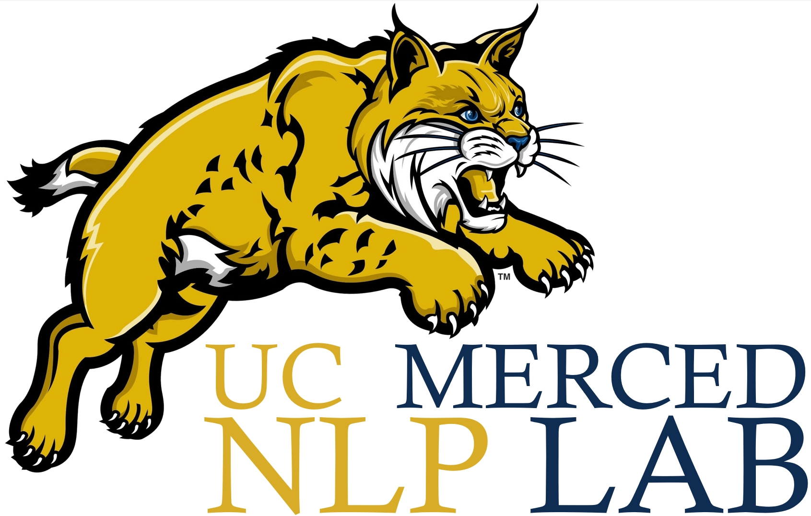
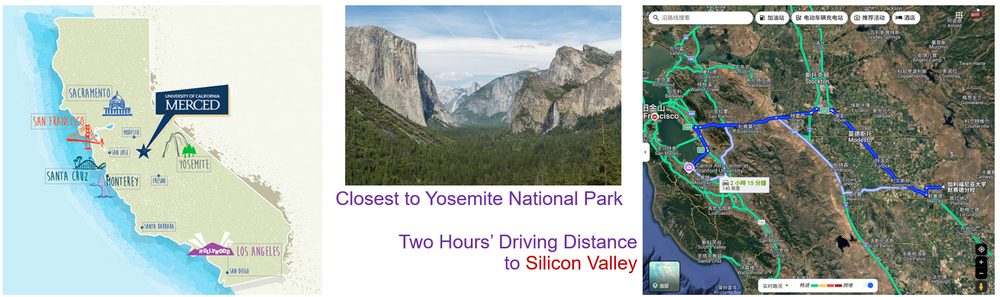

# UC Merced NLP Lab

## Our Location

UC Merced, according to US News 2024, [is ranked 58th in the U.S. universities](https://www.usnews.com/best-colleges/rankings/national-universities?schoolName=University+of+California). In the UC system, its rank higher than UC Riverside (ranked 76th) and UC Santa Cruz (ranked 84th).

**UC Merced is close to the Yosemite National Park and Silicon Valley, both of which require only 2 hours' driving. Such a distance allows the flexible internship during learning. Our lab absolutely supports all the research internships even at the beginning of Ph.D. study. Also, the advisors will utilize our own connections to help the students find the internship and job chances.**

Our connections include but are not limited to the following organizations:

## Research Aim

At the UC Merced NLP Lab, we envision a future where large language model based AI systems converge to create trustworthy intelligent assistants to serve humans in all important scenarios, e.g., education, healthcare, creative work. 
Our mission is to pioneer transformative technologies at this intersection, developing next-generation AI systems that are both technologically advanced and human-centric, ultimately building the foundation for a mutual trusted, intelligent world.
Our research focuses on large foundation models based trustworthy natural language processing and its applications as AI assistants. Our research considers not only textual but also vision data, with the target of understanding ubiquitos multi-modal data in real-world applications.

## Team Advisors

### Advisor: [Assistant Professor, Yiwei Wang](https://wangywust.github.io/)

	
	 Assistant Professor, Yiwei Wang

Yiwei Wang is an Assistant Professor at University of California, Merced. Ph.D. from NUS, MPhil from HKUST and B.S. from SEU. He serves as Area Chair for ICLR, ICML, IJCAI, ACL ARR, etc. Reviewer of TPAMI, TKDE, NeurIPS, KDD, WWW, AAAI, ICCV, CVPR, etc., Recognized as 1 out of 10 most innovative and impactful PhD students focusing on Data Science in Singapore by Singapore Data Science Consortium (SDSC) in 2020.

### [Senior Advisor: Professor, IEEE Fellow, ACM Fellow, Ming-Hsuan Yang](https://faculty.ucmerced.edu/mhyang/)

	
	 
Professor, IEEE Fellow, ACM Fellow, Ming-Hsuan Yang

ACM Fellow and IEEE Fellow, Ming-Hsuan Yang is a Professor at University of California, Merced. Ph.D. from UIUC and B.S. from NTHU. He serves as Program Chair for ICCV and ACCV, and EiC of CVIU. Currently AEiC of PAMI and AE of IJCV. SAC/AC for top conferences in computer vision (CVPR, ICCV, ECCV) and machine learning (NeurIPS, ICLR, ICML). His research has been recognized with Best Paper Award at ICML, Longuet-Higgins Prize at CVPR, and Best Paper Honorable Mentions at multiple venues. Highly Cited Researcher by Clarivate Analytics, NSF CAREER Award recipient, and Google Faculty Award recipient.

## Open Positions

We have multiple openings for PhD students, postdoctoral researchers, visiting students, research assistants, and interns:

### 1. PhD Students

3-5 full scholarship opportunities.

### 2. Visiting Students / Research Assistants / Interns

We welcome outstanding students (including qualified PhD students, master and undergraduate students, either online or in-person) to join our lab and participate in cutting-edge research projects.

## Our Support and Expectations

Our research is highly interdisciplinary, involving collaboration with experts from computer vision, healthcare, and education. Our focus is primarily on publishing in top-tier AI conferences or journals, complemented by practical implementations. Our primary goal is to prepare our students for future academic positions as well as high-impact positions in industry. Here's what we're looking for and what you can expect from this journey:

### 1. What We Offer:
- Resources: Full scholarships covering study and living in California, plus access to advanced research facilities.
- Guidance: **Hands-on mentorship with clear direction.** For outstanding students, I also offer adequate freedom and opportunities for growth.
- International Connections: Strong ties with leading researchers and institutions worldwide. I will help you build international academic connections.
- Friendly Environment and Work-Life Balance: Collaborative and supportive lab culture where teamwork and mutual respect are valued.

### 2. What We Expect from You:
- Passion for Learning: **Strong self-motivation and ability to quickly learn from new fields.**
- Personal Qualities: Responsibility, reliability, and good communication skills.

## How to apply

If you're interested in joining UC Merced NLP Lab or would like more information, please contact me:
- Email: yiweiwang2@ucmerced.edu
- Attachment: CV